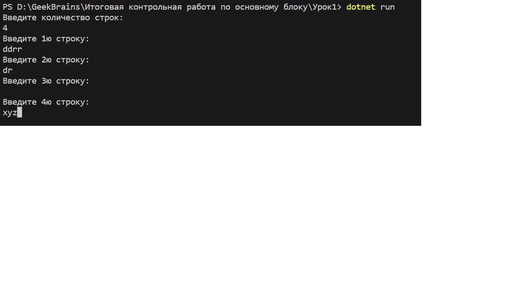
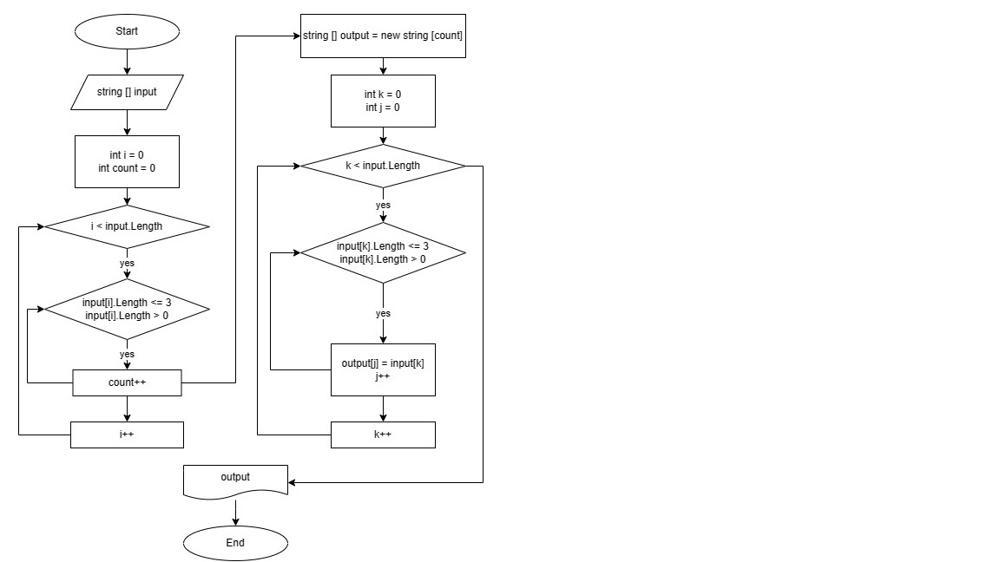
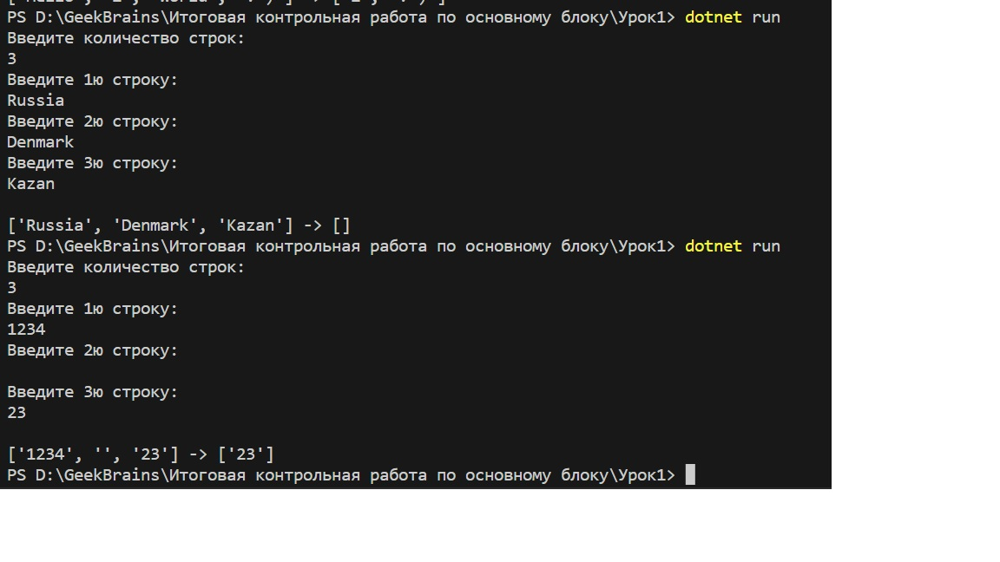

***Задача***: 

*Написать программу, которая из имеющегося массива строк формирует новый массив из строк, длина которых меньше, либо равна 3 символам. Первоначальный массив можно ввести с клавиатуры, либо задать на старте выполнения алгоритма. При решении не рекомендуется пользоваться коллекциями, лучше обойтись исключительно массивами.*

***Решение***: 

1. В условиях задачи чётко не обозначено, откуда взять изначальные данные для массива строк.
Будем считать, что их должен ввести пользователь.
Пусть он же задаст размер массива.
Для этого напишем следующий код:

```
Console.WriteLine("Введите количество строк: ");
int n = Convert.ToInt32(Console.ReadLine());
string[] array = new string[n];
```
2. Теперь размер массива определён как целое число **n**.
Пропишем код для обработки пользовательского ввода содержимого строк:
```
int i = 0;
while (i < array.Length)
{
    Console.WriteLine($"Введите {i + 1}ю строку: ");    
    array[i] = Console.ReadLine(); 
    i++;   
}
```
Т.к. нумерация элементов массива начинается с нуля, мы просим пользователя ввести **i+1*****ю*** строку. 

Реализация будет выглядеть примерно так.


Перейдём к решению основной задачи.

3. Я позволил себе небольшое допущение и предположил, что в случае, если пользователь не ввёл значение строки (ввёл пустую строку), то мы также не будет отображать в результирующем массиве такой элемент, равно как и элементы с длиной строки больше трёх символов.
В алгоритме ниже это условие представлено в виде:
```
input[i].Length <= 3
input[i].Length > 0.
```
Если нам всё же подходят пустые строки, введённые пользователем, то условие примет вид:
```
input[i].Length <= 3.
```

Перейдём непосредственно к алгоритму, предшествующему написанию метода:



Пусть в качестве входных данных для метода будет использоваться одномерный массив данных типа **string** с условным названием **input**.

Введём переменные ```int i``` (*итератор, чтобы пройтись по всем элементам массива*) и ```int count``` (*счётчик элементов, отвечающих описаному выше условию размера элемента*), обе будут равны нулю до запуска цикла.

Внешний цикл по условию ```i < input.Length``` переберёт все **n** элементов массива **input** от элемента с индексом **0** до элемента с индексом **input.Length-1** включительно.

Внутренний цикл по условиям 
```
input[i].Length <= 3
input[i].Length > 0.
```
будет увеличивать переменную ```count``` на 1 в случае их выполнения.

По итогам работы цикла мы получим искомое значение размера результирующего массива (поймём, сколько он будет содержать элементов). Как ни трудно догадаться, это и есть ```count```.
Создадим новый одномерный массив данных типа **string** и назовём его **output**.

Условия попадания элементов массива **input** в результирующий массив **output** абсолютно идентичны условиям увеличения переменной ```count``` на 1 в ранее описанных циклах.

Само попадание (присвоение) можно описать следующим образом:
```
output[j] = input[k],
```
где **j** - итератор для работы массива **output**, а **k** - итератор для работы массива **input**.
Т.к. для выбора нам нужно перебирать значения массива **input**, запустим цикл именно по переменной ```k```.

Результатом работы алгоритма станет заполнение созданного внутри метода нового массива **output** размером ```count``` со значениями, отвечающим условиям:
```
input[k].Length <= 3
input[k].Length > 0.
```
4. Напишем соответствующий метод типа string для реализации программы в C#:

```
string[] FilterByStringLength(string[] input)
{
    int count = 0;
    int i = 0;
    while (i < input.Length)
    {
        if (input[i].Length <= 3 && input[i].Length > 0) count++;
        // if (input[k].Length <= 3)
        i++;
    }
    string[] output = new string[count];
    int j = 0;
    for (int k = 0; k < input.Length; k++)
    {
        if (input[k].Length <= 3 && input[k].Length > 0)
        // if (input[k].Length <= 3) 
        {
            output[j] = input[k];
            j++;
        }
    }
    return output;
}.
```
5. Оформим программу до конца и проверим корректность работы метода.

Воспользуемся дополнительным методом типа void для вывода массивов:
```
void PrintArray(string[] arr, string sep = ",")
{
    Console.Write("[");
    for (int i = 0; i < arr.Length; i++)
    {
        if (i < arr.Length - 1) Console.Write($"'{arr[i]}'{sep} ");
        else Console.Write($"'{arr[i]}'");
    }
    Console.Write("]");
}.
```
Пропишем соответствующие вызовы:
```
Console.WriteLine();
PrintArray(array);
Console.Write(" -> ");
string[] result = FilterByStringLength(array);
PrintArray(result);
```
Напишем в терминале ```dotnet run``` и получим следующее:



Программа работает. Задача решена.